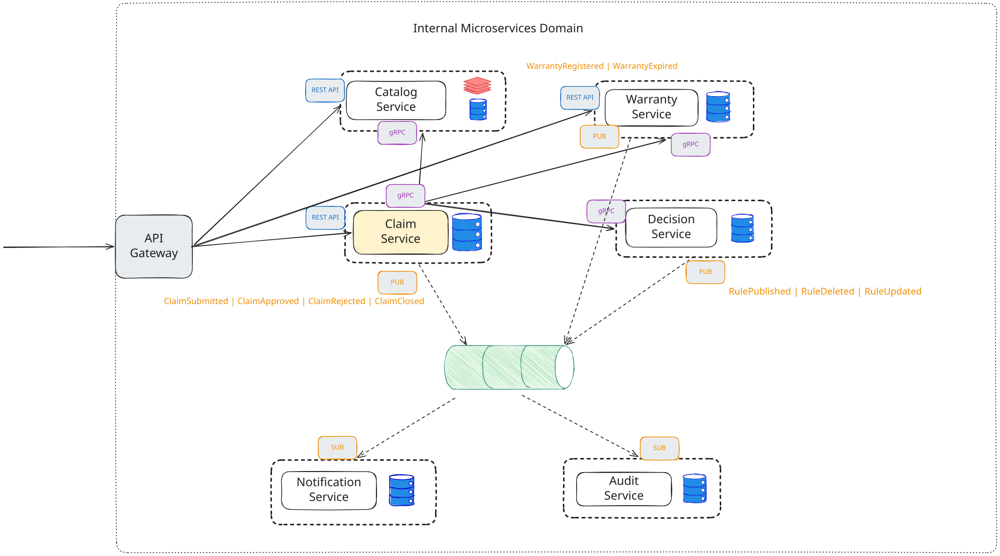

# Warranty Platform

A learning project for practicing microservice architecture — a generic
product / warranty domain built as a set of .NET services.

## Architecture




## Services

| Service | Responsibility | Storage | Status |
|---|---|---|---|
| **Catalog** | Product master data | PostgreSQL (+ Redis cache) | 🟢 In progress |
| **Warranty** | Active warranties, lifecycle | PostgreSQL | ⚪ Planned |
| **Claim** | Claim lifecycle — saga orchestration | PostgreSQL | ⚪ Planned |
| **Decision Engine** | Rule evaluation for claims | PostgreSQL | ⚪ Planned |
| **Notification** | Multi-channel delivery | PostgreSQL | ⚪ Planned |
| **Audit** | Append-only event sink | PostgreSQL | ⚪ Planned |
| **API Gateway** | Edge routing, auth | — | ⚪ Planned |
| **Event Bus** | Async pub/sub | RabbitMQ (?) | ⚪ Planned |


## Getting started

```bash
# 1. Start infrastructure (PostgreSQL)
docker compose up -d

# 2. Run the Catalog service
dotnet run --project Catalog.Service
```

On startup in Development the service applies EF Core migrations and seeds
demo data automatically. The Scalar API UI opens at `/scalar/v1`.
